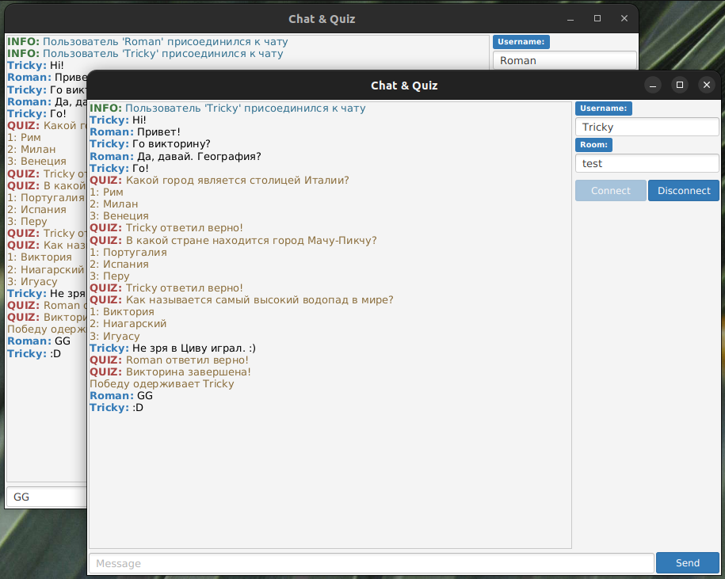

# chat-socketio-java

## Пример чата с использованием библиотеки Socket.IO

Учебный проект направления ["Основы программирования на языке Java"](https://vk.com/jkursk).

И клиент, и сервер написаны на языке Java.  
Клиент имеет графический интерфейс пользователя (используется платформа JavaFX).

### Викторины

Пользователи чата могут принять участие в викторине.  
Чтобы начать викторину, один из пользователей должен отправить сообщение с командой:

> **/q** <НазваниеВикторины>

Примечание: на данный момент существует только викторина с названием GeoQuiz.  

Чтобы ответить на вопрос викторины, пользователь должен отправить сообщение с командой:

> **/a** <ответ>

Примечание: в зависимости от вопроса ответом может быть номер варианта или текст ответа, если вариантов нет.
